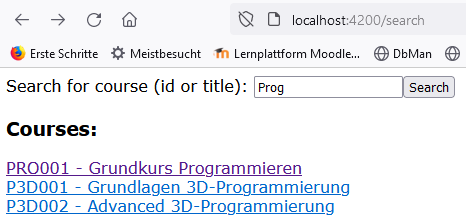
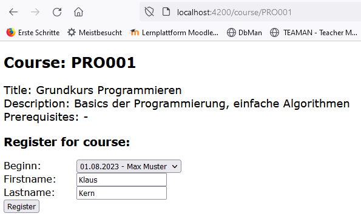

= Kursverwaltung

Für eine Volkshochschule soll eine Verwaltung der Kurse implementiert werden. +
Sie erhalten ein vorgefertigtes Projekt, das Sie entsprechend erweitern müssen.

== Datenmodell

[plantuml]
....
@startuml

Entity Course {
  id: varchar2(10) <<PK>>
  --
  title: varchar2(50) <<NOT NULL>>
  description: varchar2(2000)
  --
  prerequisite: varchar2(10) <<FK>>
}

Entity CoursePlan {
  id: int <<PK>> <<generated>>
  --
  startdate: date <<NOT NULL>>
  enddate: date
  location: varchar2(255)
  --
  course_id: varchar2(10) <<FK>> <<NOT NULL>>
  teacher: int <<FK>> <<NOT NULL>>
}

Entity Person {
  id: int <<PK>> <<generated>>
  --
  firstname: String
  lastname: String
}

Course |o--o{ Course : requires
Course ||-down-o{ CoursePlan
CoursePlan }o-right-|| Person : "← teaches"
CoursePlan }o--o{ Person : "\n← attends"

@enduml
....

Ergänzen Sie die im Package `model` bereitgestellten POJO-Klassen um das gezeigte Datenmodell abzubilden. +
Achten Sie auf die Vermerkte zu den Schlüsselattributen und Datentypen. Wird als Datentyp String angegeben kann zur Vereinfachung auf die Bestimmung der Feldgröße verzichtet werden.

Bilden Sie die Beziehungen grundsätzlich unidirektional ab. +
Einzig die Beziehung zwischen `CoursePlan` and `Person` soll bidirektional implementiert werden.

Die Konfiguration der Datenbankverbindung ist bereits in der Datei `applications.properties` enthalten.

<<<
== REST-API

Stellen Sie folgende REST-Schnittstelle zur Verfügung und nutzen Sie dazu die implementierten Repository-Klassen für den Datenbankzugriff.

.REST-API
[grid="rows", cols="1m,3a"]
|=================
|Request    |Funktionalität

| GET /api/course/search/<text>
| Sucht nach Kursen, die den übergebenen Text entweder in der `Id` oder im `Title` haben. Die Groß- und Kleinschreibung darf dabei keine Rolle spielen. +
Geben Sie alle Kurse zurück, die den Suchkriterien entsprechen.

| GET /api/course/<id>
| Liefert die Daten zu der übergebenen Kurs-ID

| GET /api/course/plan/<id>
| Liefert alle geplanten Kurstermine zu der übergebenen Kurs-ID. +
  Die Informationen zu dem Kurs selbst sollen dabei nicht in das Result kommen, da der Kurs ja bereits bekannt ist und diese Information redundant übertragen werden würde.

| POST /api/course/plan
| Speichern Sie die Anmeldung zu der übergebenen KursPlan-ID für die Person mit den übergebenen Namenswerten ab. Existiert die Person noch nicht in der Datenbank ist diese anzulegen!

.Zu verwendende Datenstruktur:
[source,json]
----
{
  "planId": 2,
  "firstname": "Hans",
  "lastname": "Huber"
}
----

|=================

<<<
== Angular-Client

Auch das Angular-Projekt wurde bereits begonnen und ist fertigzustellen.

=== a) Kurssuche

In der Komponente `SearchComponent` existiert ein Eingabefeld für die Kurs-Id oder den Kurs-Titel. Wenn der Button gedrückt wird, soll die Kurssuche ausgelöst werden und die Ergebnisse entsprechend aufgelistet werden.

.Anforderungen
* Die Suche soll unter der URL `/search` erreichbar sein
* Der Abschnitt "Courses:" soll nur angezeigt werden, wenn ein Suchergebnis vorliegt.
* Der Suchbutton soll inaktiv sein, wenn weniger als 3 Zeichen im Eingabefeld stehen
* Die einzelnen Kurseinträge sollen verlinkt sein zu folgender URL: +
`/course/<id>` (siehe nächste Aufgabenstellung)

=== b) Kursdetails und Anmeldung

In der Komponente `CourseComponent` werden die Details zu einem Kurs angezeigt. Die ID des Kurses wird dabei in der URL mitübergeben.

.Anforderungen
* Holen Sie zu Beginn die Daten zu der übergebenen Kurs-ID vom Backend ab
* Integrieren Sie die Kursdaten an den entsprechenden Positionen auf der Seite
* Wird kein Kurs gefunden soll "No course with id <id>" ausgegeben werden und es soll der Rest der Seite ausgeblendet werden
* Zeigen Sie alle geplanten Kursbeginne in dem Registrierungsformular an. Die Select-Liste soll das Startdatum (Format: dd.mm.yyyy) und den Kursleiter enthalten!
* Wird ein Datum gewählt und Vor- und Nachname eingegeben so soll die Anmeldung im Backend gespeichert werden.
* Navigieren Sie auf die Url `/registered` nachdem die Registrierung erfolgreich war.

.Screenshot Kurssuche

.Screenshot Kursanmeldung
